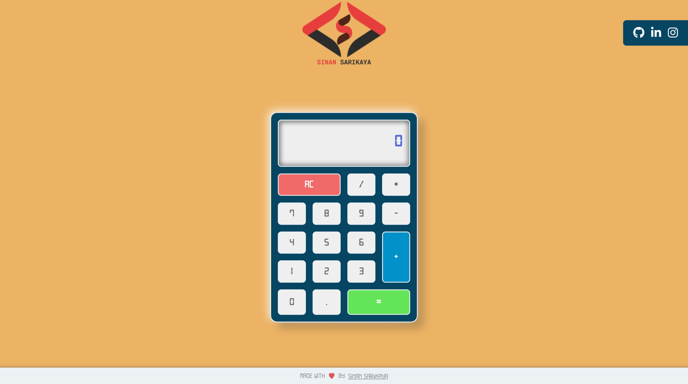

# JavaScript Calculator


Responsive calculator made using JavaScript.

<hr />

### Installation Options

```
$ git clone https://github.com/sinansarikaya/javascript-calculator.git
```

<hr />

### Demo

#### [View Demo](https://sinansarikaya.github.io/javascript-calculator/)


